# Document System Map

This document visualizes the repository documentation system and shows how the root design/spec files are maintained inside it.

## System View

```mermaid
flowchart TD
    A["Root Entry Layer"] --> B["Operational Governance Layer"]
    A --> C["Product And Design Spec Layer"]
    B --> D["Execution Control"]
    B --> E["Quality And Risk Control"]
    B --> F["Decision And Topic Docs"]
    C --> G["Product Intent"]
    C --> H["Interaction And Structure"]
    C --> I["Delivery Planning And Testing"]

    A1["AGENTS.md"] --> A
    A2["PROJECT_STATUS.md"] --> A
    A3["docs/README.md"] --> A

    B1["definition-of-ready.md"] --> D
    B2["definition-of-done.md"] --> D
    B3["document-sync-policy.md"] --> D
    B4["git-workflow.md"] --> D
    B5["multi-agent-governance.md"] --> D
    B6["risk-register.md"] --> E
    B7["traceability-matrix.md"] --> E
    B8["runtime-validation.md"] --> F
    B9["bundle-reduction-notes.md"] --> F
    B10["ADR-0001 / ADR-0002"] --> F

    C1["thinking_ide_prd_产品需求文档.md"] --> G
    C2["thinking_ide_mvp_项目文档.md"] --> G
    C3["thinking_ide_交互设计规范文档.md"] --> H
    C4["thinking_ide_低保真原型文档.md"] --> H
    C5["thinking_ide_组件设计文档.md"] --> H
    C6["thinking_ide_数据模型详细设计文档.md"] --> H
    C7["thinking_ide_技术方案文档.md"] --> H
    C8["thinking_ide_开发任务拆解文档.md"] --> I
    C9["thinking_ide_测试用例文档.md"] --> I
```

## Maintenance Model

The repo should treat documents in four maintenance bands:

| Band | Purpose | Typical files | Update expectation |
|---|---|---|---|
| Entry | Tell a human or agent where the project stands right now | `AGENTS.md`, `PROJECT_STATUS.md`, `docs/README.md` | Update whenever current focus, gates, or navigation changes |
| Governance | Define how work is executed, verified, and synchronized | `definition-of-ready`, `definition-of-done`, `document-sync-policy`, `git-workflow`, `multi-agent-governance` | Update when process or gate semantics change |
| Control | Track whether implementation and risk still line up with reality | `risk-register`, `traceability-matrix`, `runtime-validation`, bundle notes | Update when runtime guarantees, coverage, or known risks change |
| Spec | Define product/design/technical intent for the MVP | Root `thinking_ide_*.md` files | Update when implementation intentionally changes spec intent or when the spec becomes misleading |

## Root Spec Files Mapped Into The System

The root Chinese documents should not stay as an ungoverned pile. They fit naturally into the system like this:

| File | Recommended role | Source-of-truth level | Primary maintainer lane | Trigger to update |
|---|---|---|---|---|
| `thinking_ide_prd_产品需求文档.md` | Product intent and MVP scope baseline | Strategic spec | Product + architecture | When MVP scope or promised user value changes |
| `thinking_ide_mvp_项目文档.md` | High-level MVP narrative and closure definition | Strategic spec | Product + execution | When the MVP goal statement or intended closure changes |
| `thinking_ide_交互设计规范文档.md` | Interaction rules and state-feedback contract | Behavioral spec | UI + product | When interaction behavior intentionally changes |
| `thinking_ide_低保真原型文档.md` | Structural UX reference and screen/state inventory | Structural spec | UI + product | When panel structure or primary flows materially change |
| `thinking_ide_组件设计文档.md` | Component responsibility and UI architecture boundary | Structural spec | Frontend architecture | When component boundaries or communication patterns change |
| `thinking_ide_数据模型详细设计文档.md` | Entity/state/persistence contract | Contract spec | Data + persistence | When document, node, edge, source, or persistence schema semantics change |
| `thinking_ide_技术方案文档.md` | Runtime and implementation architecture | Contract spec | Architecture | When extension boot, runtime flow, storage, or host strategy changes |
| `thinking_ide_开发任务拆解文档.md` | Planned delivery decomposition | Planning spec | Execution | When the active task map becomes misleading or obsolete |
| `thinking_ide_测试用例文档.md` | Intended verification surface | Quality spec | QA + engineering | When quality gates or required scenarios materially change |

## How To Maintain Root Specs Without Creating Churn

Do not update every root spec on every slice. Instead:

1. Update `PROJECT_STATUS.md`, `risk-register`, and `traceability-matrix` first for ordinary progress.
2. Update a root spec only when a slice changes the contract that spec claims to define.
3. If implementation temporarily diverges but the spec is still the desired target, record the gap in `traceability-matrix` or `PROJECT_STATUS.md` instead of rewriting the spec to match an incomplete implementation.
4. If a root spec is no longer a desired target and has become misleading, update it in the same slice that establishes the new direction.

## Trigger Matrix For Root Specs

| Change type | Root docs that should be reviewed |
|---|---|
| Runtime architecture change | `技术方案文档`, `组件设计文档`, `数据模型详细设计文档` |
| Interaction behavior change | `交互设计规范文档`, `低保真原型文档`, `PRD` |
| Persistence or schema change | `数据模型详细设计文档`, `技术方案文档`, `测试用例文档` |
| Quality gate or validation strategy change | `测试用例文档`, `开发任务拆解文档`, `技术方案文档` |
| Scope/MVP promise change | `PRD`, `MVP 项目文档`, `开发任务拆解文档` |

## Recommended Working Rule

When a slice lands, ask two questions:

1. Which operational docs must be updated so the repo reflects reality now?
2. Which root specs must be reviewed so the intended design contract still matches reality or explicitly records the gap?

The first question is governed by [document-sync-policy.md](/Users/qyx/Desktop/project/thinking-ide/docs/document-sync-policy.md). The second question should be answered using the root-spec trigger matrix above.
